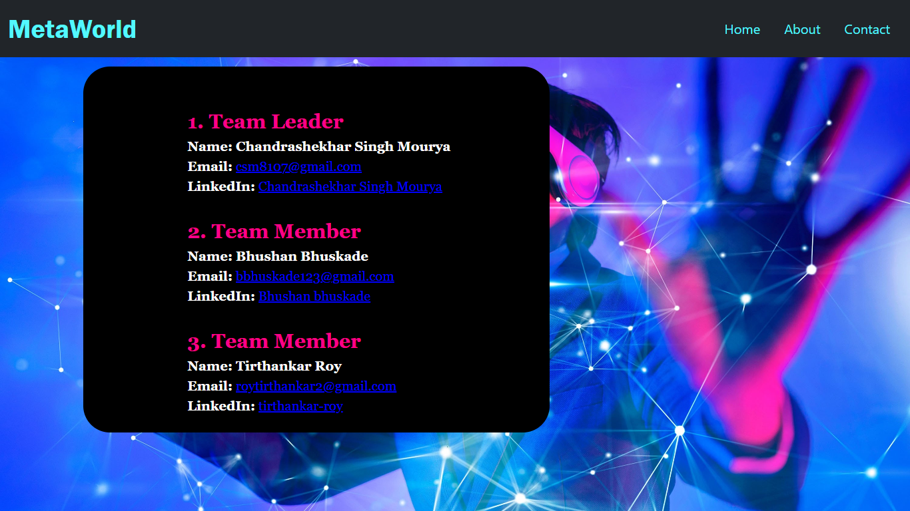

# MetaPod

## Overview
Our project `MetaPod` is capable of providing us with a virtual shopping experience, buying products, watching live shows, and many more fascinating things. So let's dive into this metaPod and explore it in a better way.
---

## Use Cases

## Homepage

## Contact Page

---

## Features
**1. Built a 3D space**
 

 
---
**2. Ability to view products in a 3D Space**
 

 
---
**3. Add to cart feature with voice recognition**
  
---
**4.Virtual Theatre**
 

## Future Scope

